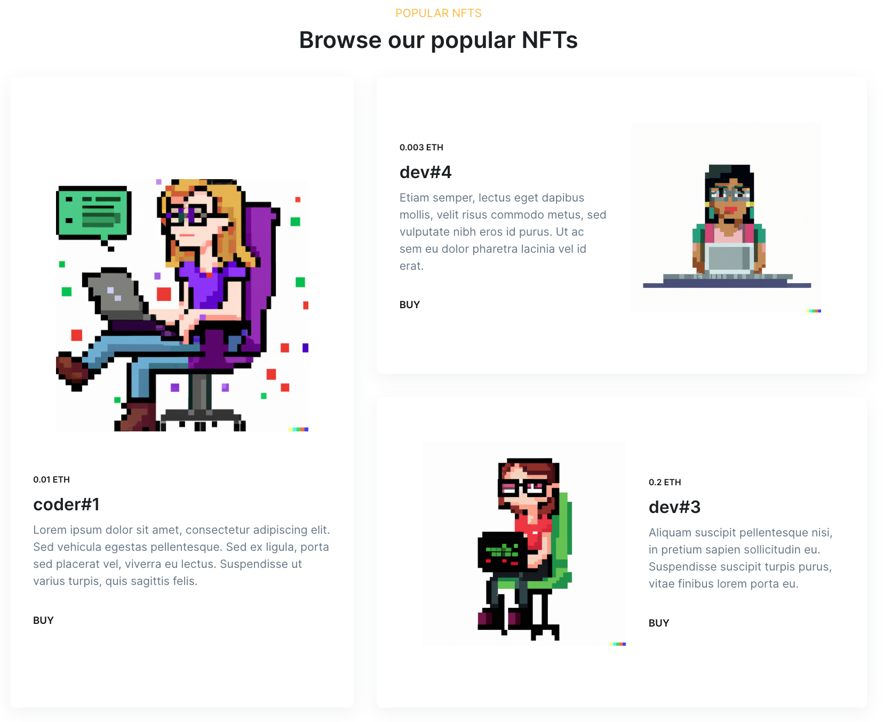
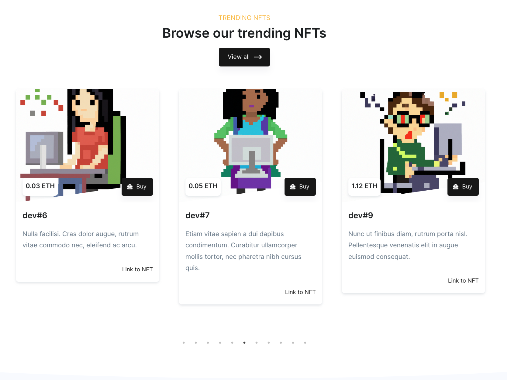

<!-- PROJECT SHIELDS -->

[![Forks][forks-shield]][forks-url]
[![Stargazers][stars-shield]][stars-url]
[![Issues][issues-shield]][issues-url]
[![MIT License][license-shield]][license-url]
[![LinkedIn][linkedin-shield]][linkedin-url]

<!-- PROJECT LOGO -->

<br />
<div align="center">
  <a href="#">
    
  </a>

  <h3 align="center">NFT Marketplace</h3>
  <a href="https://marketplace-46f99.web.app/">Link</a>

</div>

<!-- ABOUT THE PROJECT -->

## About The Project

<p align="left">
    An awesome marketplace to turn your products or services into publicly tradeable items.
</p>

#### Network

Contract is deployed on Polygon mumbai network

```sh
Marketplace Address: 0xFC825b8f07E465c32b199Ecf5b0f3B679A4285b0
RPC URL: https://rpc-mumbai.maticvigil.com
```

https://mumbai.polygonscan.com/address/0xFC825b8f07E465c32b199Ecf5b0f3B679A4285b0

### ⚙️Functions:

- Web3 auth using metamask🦊/walletconnect/coinbase
- Create & list tokens for sale
- Using IPFS for uploading the file📁
- Marketplace owner can set platform fee
- Buyer can purchase token and list it again for sale

</img>
</img>
</img>
</img>

<p align="right">(<a href="#top">back to top</a>)</p>

### Built With

- [Next.js](https://nextjs.org/)
- [Material UI](https://mui.com/)
- [Hardhat](https://hardhat.org/)
- [Solidity](https://docs.soliditylang.org/)

<p align="right">(<a href="#top">back to top</a>)</p>

### Installation

Below are instructions to get started

1. Clone the repo
   ```sh
   git clone https://github.com/ac12644/NFT-Marketplace.git
   ```
2. Install packages
   ```sh
   yarn
   ```
3. Add environment variables, also you will require dedicated subdomain for IPFS from infura
   ```sh
   PRIVATE_KEY=
   MUMBAI_URL= https://rpc-mumbai.maticvigil.com/
   INFURA_IPFS_ID=
   INFURA_IPFS_SECRET=
   INFURA_IPFS_DOMAIN=
   ```
4. Deploy smart contract
   ```sh
   npx hardhat run scripts/deploy.js --network mumbai
   ```
5. Run application
   ```sh
   yarn run dev
   ```

### Specification

#### Solidity Functions

1. Mint token and list on marketplace

```solidity
  function createToken(string memory tokenURI, uint256 price)
    public
    payable
    returns (uint256)
  {
    _tokenIds.increment();
    uint256 newTokenId = _tokenIds.current();

    _mint(msg.sender, newTokenId);
    _setTokenURI(newTokenId, tokenURI);
    createMarketItem(newTokenId, price);
    return newTokenId;
  }

  function createMarketItem(uint256 tokenId, uint256 price) private {
    require(price > 0, 'Price must be at least 1 wei');
    require(msg.value == listingPrice, 'Price must be equal to listing price');

    idToMarketItem[tokenId] = MarketItem(
      tokenId,
      payable(msg.sender),
      payable(address(this)),
      price,
      false
    );

    _transfer(msg.sender, address(this), tokenId);
    emit MarketItemCreated(tokenId, msg.sender, address(this), price, false);
  }
```

2. Creates the sale of a marketplace item and transfers ownership of the item, as well as funds between parties

```solidity
function createMarketSale(uint256 tokenId) public payable {
    uint256 price = idToMarketItem[tokenId].price;
    address seller = idToMarketItem[tokenId].seller;
    require(
      msg.value == price,
      'Please submit the asking price in order to complete the purchase'
    );
    idToMarketItem[tokenId].owner = payable(msg.sender);
    idToMarketItem[tokenId].sold = true;
    idToMarketItem[tokenId].seller = payable(address(0));
    _itemsSold.increment();
    _transfer(address(this), msg.sender, tokenId);
    payable(owner).transfer(listingPrice);
    payable(seller).transfer(msg.value);
  }
```

3. Returns unsold items listed on marketplace

```solidity
function fetchMarketItems() public view returns (MarketItem[] memory) {
    uint256 itemCount = _tokenIds.current();
    uint256 unsoldItemCount = _tokenIds.current() - _itemsSold.current();
    uint256 currentIndex = 0;

    MarketItem[] memory items = new MarketItem[](unsoldItemCount);
    for (uint256 i = 0; i < itemCount; i++) {
      if (idToMarketItem[i + 1].owner == address(this)) {
        uint256 currentId = i + 1;
        MarketItem storage currentItem = idToMarketItem[currentId];
        items[currentIndex] = currentItem;
        currentIndex += 1;
      }
    }
    return items;
  }
```

3. Resell purchased token

```solidity
  function resellToken(uint256 tokenId, uint256 price) public payable {
    require(
      idToMarketItem[tokenId].owner == msg.sender,
      'Only item owner can perform this operation'
    );
    require(msg.value == listingPrice, 'Price must be equal to listing price');
    idToMarketItem[tokenId].sold = false;
    idToMarketItem[tokenId].price = price;
    idToMarketItem[tokenId].seller = payable(msg.sender);
    idToMarketItem[tokenId].owner = payable(address(this));
    _itemsSold.decrement();

    _transfer(msg.sender, address(this), tokenId);
  }

```

4. Returns only item purchased by user

```solidity
function fetchMyNFTs() public view returns (MarketItem[] memory) {
    uint256 totalItemCount = _tokenIds.current();
    uint256 itemCount = 0;
    uint256 currentIndex = 0;

    for (uint256 i = 0; i < totalItemCount; i++) {
      if (idToMarketItem[i + 1].owner == msg.sender) {
        itemCount += 1;
      }
    }

    MarketItem[] memory items = new MarketItem[](itemCount);
    for (uint256 i = 0; i < totalItemCount; i++) {
      if (idToMarketItem[i + 1].owner == msg.sender) {
        uint256 currentId = i + 1;
        MarketItem storage currentItem = idToMarketItem[currentId];
        items[currentIndex] = currentItem;
        currentIndex += 1;
      }
    }
    return items;
  }
```

5. Returns only item user has listed on marketplace

```solidity
function fetchItemsListed() public view returns (MarketItem[] memory) {
    uint256 totalItemCount = _tokenIds.current();
    uint256 itemCount = 0;
    uint256 currentIndex = 0;

    for (uint256 i = 0; i < totalItemCount; i++) {
      if (idToMarketItem[i + 1].seller == msg.sender) {
        itemCount += 1;
      }
    }

    MarketItem[] memory items = new MarketItem[](itemCount);
    for (uint256 i = 0; i < totalItemCount; i++) {
      if (idToMarketItem[i + 1].seller == msg.sender) {
        uint256 currentId = i + 1;
        MarketItem storage currentItem = idToMarketItem[currentId];
        items[currentIndex] = currentItem;
        currentIndex += 1;
      }
    }
    return items;
  }
```

6. Give access to marketplace owner to update listing fees for users

```solidity
function updateListingPrice(uint256 _listingPrice) public payable {
    require(
      owner == msg.sender,
      'Only marketplace owner can update listing price.'
    );
    listingPrice = _listingPrice;
  }
```

7. Get the listing price of the contract

```solidity
function getListingPrice() public view returns (uint256) {
    return listingPrice;
  }
```

#### Javascript functions

1. INFURA IPFS uploader

```javascript
const auth =
  'Basic ' + Buffer.from(projectId + ':' + projectSecret).toString('base64');

const client = create({
  host: 'ipfs.infura.io',
  port: 5001,
  protocol: 'https',
  headers: {
    authorization: auth,
  },
});

async function onChange(e) {
  const file = e.target.files[0];
  try {
    const added = await client.add(file, {
      progress: (prog) => console.log(`received: ${prog}`),
    });
    const url = `${infuraDomain}/ipfs/${added.path}`; //DEDICATED SUBDOMAIN FROM INFURA
    console.log(url);
  } catch (error) {
    console.log('Error uploading file: ', error);
  }
}
```

2. Create NFT and put on sale

```javascript
  async function createSale(url) {
      const web3Modal = new Web3Modal({
        network: 'mainnet',
        cacheProvider: true,
      });
      const connection = await web3Modal.connect();
      const provider = new ethers.providers.Web3Provider(connection);
      const signer = provider.getSigner();

      const price = web3.utils.toWei(formik.values.price, 'ether');
      let contract = new ethers.Contract(
        marketAddress,
        Marketplace.abi,
        signer,
      );
      let listingPrice = await contract.getListingPrice();
      listingPrice = listingPrice.toString();
      let transaction = await contract.createToken(url, price, {
        value: listingPrice,
      });
      try {
        await transaction.wait();
        console.log(transaction.transactionHash);
      } catch (error) {
        alert('Error in creating NFT! Please try again.');

      }

  async function createMarket() {
    const { name, description, price, address } = formik.values;
    if (!name || !description || !price || !fileUrl) return;
    /* first, upload to IPFS */
    const data = JSON.stringify({
      name,
      description,
      address,
      image: fileUrl,
    });
    try {
      const added = await client.add(data);
      const url = `${infuraDomain}/ipfs/${added.path}`;
      createSale(url);
    } catch (error) {
      console.log('Error uploading file: ', error);
    }
  }


```

3. Get listed NFTs

```javascript
async function loadNFTs() {
  const provider = new ethers.providers.JsonRpcProvider(
    'https://rpc-mumbai.maticvigil.com',
  );
  const marketContract = new ethers.Contract(
    marketAddress,
    Marketplace.abi,
    provider,
  );
  const data = await marketContract.fetchMarketItems();

  const items = await Promise.all(
    data.map(async (i) => {
      const tokenUri = await marketContract.tokenURI(i.tokenId);
      const meta = await axios.get(tokenUri);
      let price = ethers.utils.formatUnits(i.price.toString(), 'ether');
      let item = {
        price,
        tokenId: i.tokenId.toNumber(),
        seller: i.seller,
        owner: i.owner,
        image: meta.data.image,
        name: meta.data.name,
        description: meta.data.description,
        address: meta.data.address,
      };
      return item;
    }),
  );
  {
    console.log('items: ', items);
  }
}
```

4. Purchase NFT

```javascript
async function buyNft(nft) {
  /* needs the user to sign the transaction, so will use Web3Provider and sign it */
  const web3Modal = new Web3Modal();
  const connection = await web3Modal.connect();
  const provider = new ethers.providers.Web3Provider(connection);
  const signer = provider.getSigner();
  const marketContract = new ethers.Contract(
    marketAddress,
    Marketplace.abi,
    signer,
  );
  /* user will be prompted to pay the asking proces to complete the transaction */
  const price = ethers.utils.parseUnits(nft.price.toString(), 'ether');
  const transaction = await marketContract.createMarketSale(nft.tokenId, {
    value: price,
  });
  await transaction.wait();
  loadNFTs();
}
```

5. Get owned NFTs

```javascript
async function loadNFTs() {
  const web3Modal = new Web3Modal({
    network: 'mainnet',
    cacheProvider: true,
  });
  const connection = await web3Modal.connect();
  const provider = new ethers.providers.Web3Provider(connection);
  const signer = provider.getSigner();
  const marketContract = new ethers.Contract(
    marketAddress,
    Marketplace.abi,
    signer,
  );
  const data = await marketContract.fetchMyNFTs();
  const items = await Promise.all(
    data.map(async (i) => {
      const tokenURI = await marketContract.tokenURI(i.tokenId);
      const meta = await axios.get(tokenURI);
      let price = ethers.utils.formatUnits(i.price.toString(), 'ether');
      let item = {
        price,
        tokenId: i.tokenId.toNumber(),
        seller: i.seller,
        owner: i.owner,
        image: meta.data.image,
        tokenURI,
      };
      return item;
    }),
  );
}
```

<!-- CONTRIBUTING -->

## Contributing

Contributions are what make the open source community such an amazing place to learn, inspire, and create. Any contributions you make are **greatly appreciated**.

If you have a suggestion that would make this better, please fork the repo and create a pull request. You can also simply open an issue with the tag "enhancement".
Don't forget to give the project a star! Thanks again!

1. Fork the Project
2. Create your Feature Branch (`git checkout -b feature/AmazingFeature`)
3. Commit your Changes (`git commit -m 'Add some AmazingFeature'`)
4. Push to the Branch (`git push origin feature/AmazingFeature`)
5. Open a Pull Request

<p align="right">(<a href="#top">back to top</a>)</p>
 
 
<!-- LICENSE -->
## License

Distributed under the MIT License. See `LICENSE.txt` for more information.

<p align="right">(<a href="#top">back to top</a>)</p>

<!-- MARKDOWN LINKS & IMAGES -->

[forks-shield]: https://img.shields.io/github/forks/ac12644/NFT-Marketplace?style=for-the-badge
[forks-url]: https://github.com/ac12644/NFT-Marketplace/network/members
[stars-shield]: https://img.shields.io/github/stars/ac12644/NFT-Marketplace?style=for-the-badge
[stars-url]: https://github.com/ac12644/NFT-Marketplace/stargazers
[issues-shield]: https://img.shields.io/github/issues/ac12644/NFT-Marketplace?style=for-the-badge
[issues-url]: https://github.com/ac12644/NFT-Marketplace/issues
[license-shield]: https://img.shields.io/github/license/ac12644/NFT-Marketplace?style=for-the-badge
[license-url]: https://github.com/ac12644/NFT-Marketplace/blob/master/LICENSE.txt
[linkedin-shield]: https://img.shields.io/badge/-LinkedIn-black.svg?style=for-the-badge&logo=linkedin&colorB=555
[linkedin-url]: https://www.linkedin.com/in/ac12644/
